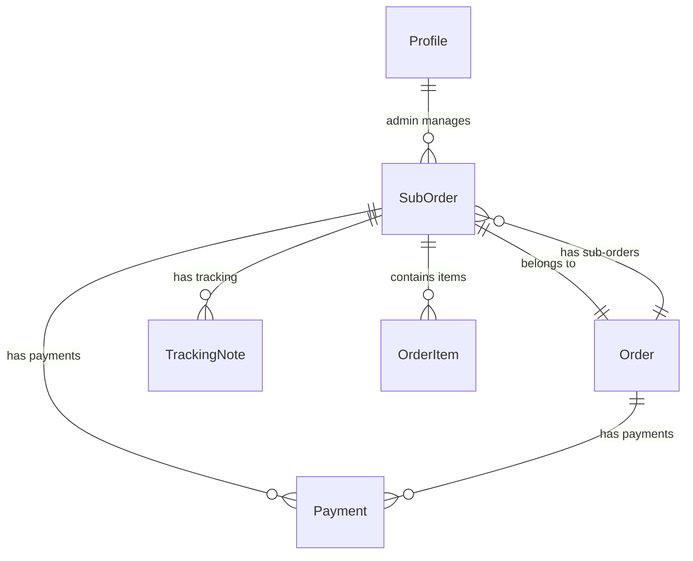

# Data Model: Panel Administrativo y Tracking

**Feature**: 006-admin-panels-tracking
**Date**: 2026-08-27
**Source**: docs/DATABASE.md

## Entities

### Profile (existing)

**Purpose**: Perfiles de usuario con roles de administrador

| Field | Type | Constraints | Description |
|-------|------|-------------|-------------|
| id | UUID | PK, FK auth.users | User ID |
| full_name | TEXT | | Nombre completo |
| phone | TEXT | | Teléfono |
| avatar_url | TEXT | | URL de avatar |
| role | TEXT | NOT NULL, CHECK IN (customer, admin_hl, admin_kc, superadmin) | Rol del usuario |
| created_at | TIMESTAMPTZ | DEFAULT NOW() | Fecha de creación |
| updated_at | TIMESTAMPTZ | DEFAULT NOW() | Fecha de actualización |

**RLS Policies**:
- Users can manage own profile: `auth.uid() = id`
- Admin HL can manage books: `role IN ('admin_hl', 'superadmin')`
- Admin KC can manage products: `role IN ('admin_kc', 'superadmin')`

---

### Sub-Order (existing, primary entity for admin)

**Purpose**: Sub-órdenes por marca gestionadas por administradores

| Field | Type | Constraints | Description |
|-------|------|-------------|-------------|
| id | UUID | PK, FK orders | Sub-order ID |
| order_id | UUID | NOT NULL, FK orders | Orden maestra |
| brand | TEXT | NOT NULL, CHECK IN (hl, kc) | Marca |
| order_number | TEXT | NOT NULL, UNIQUE | Número de sub-orden |
| status | TEXT | NOT NULL, DEFAULT 'pending_payment' | Estado actual |
| subtotal | DECIMAL(10,2) | NOT NULL | Subtotal de la sub-orden |
| tracking_number | TEXT | | Número de tracking |
| notes | TEXT | | Notas internas |
| created_at | TIMESTAMPTZ | DEFAULT NOW() | Fecha de creación |
| updated_at | TIMESTAMPTZ | DEFAULT NOW() | Fecha de actualización |

**Status Enum**:
```
pending_payment → payment_verified → preparing → shipped → in_transit → delivered
```

**RLS Policies**:
- Admin HL manages HL sub_orders: `brand = 'hl' AND role IN ('admin_hl', 'superadmin')`
- Admin KC manages KC sub_orders: `brand = 'kc' AND role IN ('admin_kc', 'superadmin')`

---

### Payment (existing, primary entity for verification)

**Purpose**: Registros de pago para verificación administrativa

| Field | Type | Constraints | Description |
|-------|------|-------------|-------------|
| id | UUID | PK | Payment ID |
| order_id | UUID | NOT NULL, FK orders | Orden asociada |
| amount | DECIMAL(10,2) | NOT NULL | Monto del pago |
| method | TEXT | NOT NULL, CHECK IN (pago_movil, binance) | Método de pago |
| status | TEXT | NOT NULL, DEFAULT 'pending' | Estado de verificación |
| proof_url | TEXT | | URL del comprobante |
| proof_number | TEXT | | Referencia/hash |
| notes | TEXT | | Motivo de rechazo |
| verified_by | UUID | FK auth.users | Admin que verificó |
| verified_at | TIMESTAMPTZ | | Fecha de verificación |
| created_at | TIMESTAMPTZ | DEFAULT NOW() | Fecha de creación |

**Status Enum**:
```
pending → verified | rejected
```

---

### Tracking-Note (existing)

**Purpose**: Bitácora de seguimiento geográfico

| Field | Type | Constraints | Description |
|-------|------|-------------|-------------|
| id | UUID | PK | Note ID |
| sub_order_id | UUID | NOT NULL, FK sub_orders | Sub-orden asociada |
| location | TEXT | NOT NULL | Ubicación (ej: Maracaibo) |
| note | TEXT | | Descripción del seguimiento |
| created_by | UUID | FK auth.users | Admin que creó la nota |
| created_at | TIMESTAMPTZ | DEFAULT NOW() | Timestamp |

**RLS Policies**:
- Hereda de sub_orders (admin_hl para brand='hl', admin_kc para brand='kc')

---

### Order (existing, referenced)

**Purpose**: Orden maestra (referencia para sub-ordenes)

| Field | Type | Constraints | Description |
|-------|------|-------------|-------------|
| id | UUID | PK | Order ID |
| user_id | UUID | NOT NULL, FK auth.users | Cliente |
| order_number | TEXT | NOT NULL, UNIQUE | Número de orden |
| status | TEXT | NOT NULL, DEFAULT 'pending_payment' | Estado general |
| total_amount | DECIMAL(10,2) | NOT NULL | Total de la orden |
| shipping_cost | DECIMAL(10,2) | DEFAULT 0 | Costo de envío |
| shipping_method | TEXT | CHECK IN (mrw, zoom) | Empresa de envío |
| shipping_address | JSONB | NOT NULL | Dirección de envío |
| payment_method | TEXT | NOT NULL | Método de pago |
| payment_status | TEXT | NOT NULL, DEFAULT 'pending' | Estado del pago |
| notes | TEXT | | Notas |
| created_at | TIMESTAMPTZ | DEFAULT NOW() | Fecha de creación |
| updated_at | TIMESTAMPTZ | DEFAULT NOW() | Fecha de actualización |

---

### Order-Item (existing, referenced)

**Purpose**: Ítems de la sub-orden

| Field | Type | Constraints | Description |
|-------|------|-------------|-------------|
| id | UUID | PK | Item ID |
| sub_order_id | UUID | NOT NULL, FK sub_orders | Sub-orden |
| item_type | TEXT | NOT NULL, CHECK IN (book, product) | Tipo de ítem |
| item_id | UUID | NOT NULL | ID del libro/producto |
| item_name | TEXT | NOT NULL | Nombre del ítem |
| item_price | DECIMAL(10,2) | NOT NULL | Precio unitario |
| quantity | INTEGER | NOT NULL | Cantidad |
| extras | JSONB | DEFAULT '[]' | Extras seleccionados |
| customization | JSONB | DEFAULT '{}' | Personalización |
| subtotal | DECIMAL(10,2) | NOT NULL | Subtotal del ítem |

---

## Relationships



## State Transitions

### Sub-Order Status

```
pending_payment
    ↓ (payment verified)
payment_verified
    ↓ (admin prepares)
preparing
    ↓ (admin ships)
shipped
    ↓ (in transit)
in_transit
    ↓ (delivered)
delivered
```

**Allowed transitions**:
- pending_payment → payment_verified
- payment_verified → preparing
- preparing → shipped
- shipped → in_transit
- in_transit → delivered

**Blocked transitions** (show error message):
- Any → pending_payment (except initial)
- Any → delivered (must go through in_transit)
- delivered → any (terminal state)

### Payment Status

```
pending
    ↓ (admin approves)
verified
    ↓ (admin rejects)
rejected
```

## Validation Rules

### Payment Verification

| Rule | Description | Error Message |
|------|-------------|---------------|
| Amount match | Payment amount must match order total | "El monto no coincide con el total de la orden" |
| Valid transition | Payment must be in 'pending' state | "Este pago ya fue verificado" |
| Proof required | proof_url must not be empty | "Debe subir un comprobante de pago" |

### State Transitions

| Rule | Description | Error Message |
|------|-------------|---------------|
| Linear flow | Cannot skip states | "No se puede saltar a este estado" |
| No retroceso | Cannot go to previous states | "No se puede volver a un estado anterior" |
| Terminal state | Cannot change from 'delivered' | "La orden ya fue entregada" |

## Indexes

```sql
-- Performance indexes for admin queries
CREATE INDEX idx_sub_orders_brand ON sub_orders(brand);
CREATE INDEX idx_sub_orders_status ON sub_orders(status);
CREATE INDEX idx_sub_orders_created ON sub_orders(created_at DESC);
CREATE INDEX idx_payments_status ON payments(status);
CREATE INDEX idx_payments_order ON payments(order_id);
CREATE INDEX idx_tracking_notes_sub_order ON tracking_notes(sub_order_id);
CREATE INDEX idx_tracking_notes_created ON tracking_notes(created_at DESC);
```
